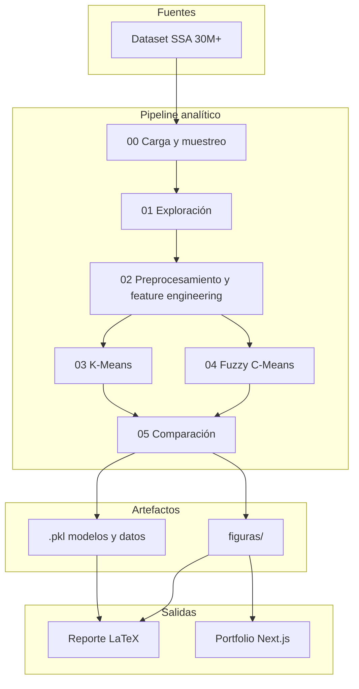

# Case Study: Perfiles de riesgo COVID-19 en México

Identificación de perfiles de riesgo en pacientes COVID-19 a partir de datos abiertos de la Secretaría de Salud, mediante clustering (K-means y Fuzzy C-Means). Proyecto final de Analítica Avanzada de Datos, ESCOM-IPN.

---

## 1. Contexto (breve, pero real)

El problema no era solo “analizar datos de COVID”; era **reducir la incertidumbre en el triage** y en la priorización de recursos cuando UCI, ventiladores y camas son escasos. Los stakeholders eran salud pública (asignación de recursos), evaluación académica (Analítica Avanzada) y, en perspectiva, equipos clínicos que necesitan perfiles interpretables.

El sistema vivía en un entorno de datos abiertos de la Dirección General de Epidemiología (2020–2024), con decenas de millones de registros, y en un marco académico con fecha de entrega y criterios claros: objetivos, metodología y reporte en LaTeX.

Lo que dolía de verdad era no tener **perfiles de riesgo multivariados**: se conocían factores aislados (edad, diabetes, etc.), pero no cómo se combinan en la realidad. Faltaba evidencia cuantitativa para decidir de forma consistente hospitalización, ingreso a UCI o intubación en picos pandémicos.

---

## 2. Restricciones (oro puro)

- **Tiempo:** Proyecto académico con entrega fija (9 ene 2026). Alcance acotado a clustering, reporte y portfolio; no despliegue operativo.
- **Infraestructura:** Límite de GitHub (100 MB por archivo). Datos crudos y `.pkl` no se versionan; quien clona debe ejecutar `descargar_datos.py` y correr los notebooks. README recomienda 16 GB+ de RAM para la muestra.
- **Usuarios reales:** No hay despliegue en hospitales. Los “usuarios” son evaluadores y quien consulte el portfolio o el reporte.
- **Costos:** Sin presupuesto de nube. Todo local: Conda, Jupyter, datos descargados.
- **Legacy / caos:** Datos oficiales con sesgo de reporte, variables faltantes (vacunación, variantes, tratamientos), heterogeneidad temporal 2020–2024 y granularidad geográfica limitada.
- **Equipo:** Tres personas; coordinación y reparto de tareas (notebooks, documento, portfolio) condicionaron el alcance.

---

## 3. Decisiones clave (el corazón)

- **K-Means y Fuzzy C-Means (y no solo uno):** Dado que hacía falta tanto una clasificación clara para triage como la identificación de casos fronterizos, decidimos usar ambos: K-Means para asignación definitiva y eficiencia sobre millones de registros; FCM para perfiles mixtos y priorización de casos límite mediante pertenencias parciales.

- **Muestreo estratificado y no el dataset completo:** Dado el tamaño (30M+ registros) y los límites de memoria y tiempo, decidimos muestreo estratificado para mantener representatividad sin colapsar el pipeline.

- **k=9 (K-Means) y c=2 (FCM):** Dado el método del codo, Silhouette y FPC, elegimos k=9 para granularidad interpretable y c=2 para una estructura bajo/alto riesgo con pertenencias. Aceptamos el trade-off: más clusters dan más detalle pero más complejidad al comunicar.

- **PCA solo para visualización:** Decidimos entrenar el clustering con las 17 variables estandarizadas y usar PCA únicamente para reducir dimensión en gráficos, no como espacio de clustering.

- **Portfolio en Next.js:** Dado que los resultados debían llegar a no técnicos y al profesorado, decidimos una capa de presentación web (Next.js, React, Recharts, Framer Motion) además del reporte LaTeX: narrativa, galería y gráficos interactivos.

---

## 4. Sistema / Arquitectura (abstracto, no tutorial)

**Flujos y responsabilidades:** Los notebooks 00–02 llevan los datos crudos a una muestra estratificada, limpieza, variables derivadas y escalado. Los notebooks 03–05 ejecutan el clustering (K-Means y FCM), evaluación (Silhouette, Davies-Bouldin, ARI, NMI) y comparación. Los artefactos (.pkl y figuras) alimentan el reporte en LaTeX y el portfolio Next.js. El portfolio es presentación pública (Hero, Contexto, Metodología, Resultados, Galería) con gráficos interactivos; los datos son estáticos/exportados, sin conexión en vivo a los .pkl.

---

## 5. Qué salió mal (obligatorio)

- **Letalidad 100 % en todos los clusters:** En los resultados, todos los clusters mostraban letalidad 100 %, lo que obligó a dejar documentada la necesidad de validar el dataset y revisar la variable FALLECIDO. No se corrigió antes del cierre; se asumió como limitación conocida.

- **Subestimamos la calidad de la variable de desenlace:** Confiamos en FALLECIDO para caracterizar los clusters sin una validación cruzada temprana con el diccionario de datos y posibles sesgos de registro. Eso restó fuerza a la interpretación en mortalidad.

- **Doble fuente de figuras:** Las visualizaciones se generaron en los notebooks para LaTeX y luego se reutilizaron en el portfolio sin una única “fuente de verdad”; en algún momento la galería del portfolio pudo quedar desfasada respecto a las figuras del reporte.

---

## 6. Impacto / Resultado

- El reporte se entregó y evaluó; el portfolio está disponible para mostrar el trabajo en contexto académico y profesional.
- Se obtuvieron 9 perfiles con K-Means y 2 grupos con FCM, caracterizados por edad, comorbilidades, hospitalización y severidad. Se identificaron perfiles como jóvenes con alta hospitalización y baja comorbilidad (Clusters 4 y 6), útiles para políticas de salud.
- El pipeline es reproducible (notebooks, semillas fijas, documentación); el documento incluye trabajo a futuro (HDBSCAN, GMM, datos adicionales, análisis temporal) como base para extensiones.
- Contribución en la materia: aplicación de clustering, scikit-learn, scikit-fuzzy, preprocesamiento y comunicación de resultados a nivel analítico y presentación.

---

## 7. Qué harías distinto hoy

- **Datos:** Validaría la variable FALLECIDO desde el inicio (diccionario, cruces con otras variables) antes de cerrar resultados; si hubiera datos de vacunación o variantes, los incluiría desde el diseño del preprocesamiento.

- **Metodología:** Probaría HDBSCAN o GMM para ver si geometrías no esféricas mejoran algunos clusters; evaluaría si bajar a menos clusters (p. ej. 5–6) facilita la comunicación con perfiles clínicos sin perder lo esencial.

- **Comunicación:** Unificaría desde el principio el set de figuras entre LaTeX y portfolio (una sola carpeta o script que exporte lo que usa cada uno) y definiría una fuente única de métricas (p. ej. CSV exportado desde los notebooks) para el dashboard del portfolio.

- **Infraestructura:** Añadiría un script de reproducción (p. ej. `run_all.sh` o un Makefile) que ejecute los notebooks en orden para quien clona el repo y quiera reproducir todo el flujo.
